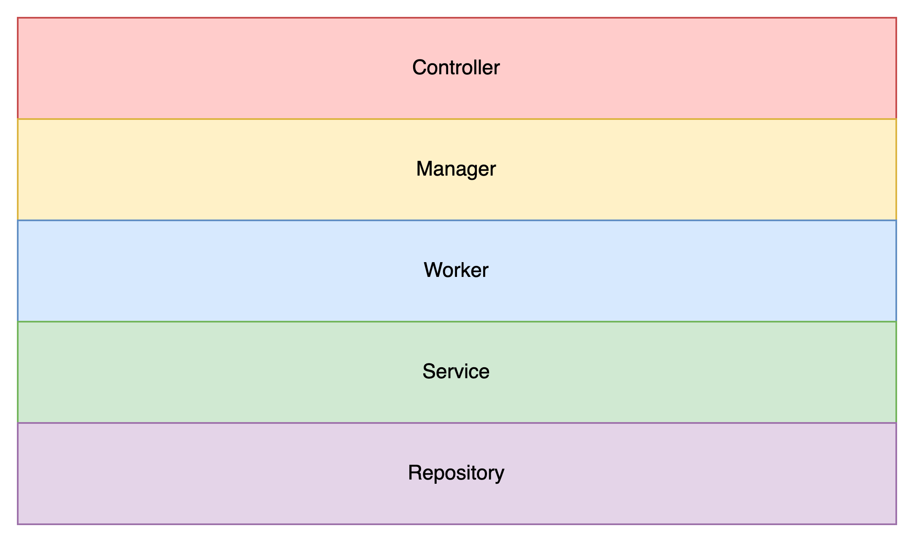

## Punch Bank 
### 소스 코드 구조
- Spring MVC 구조

해당 프로젝트는 계층형 구조를 가지며 하위 계층의 컴포넌트는 상위 계층을 의존할 수 없다.  
**Controller**  
프로그램이 요청을 받는 엔드포인트이며, 요청 및 응답과 관련된 역할을 수행한다.  
**Manager**  
요청당 수행해야하는 기능을 책임지는 계층이다. Manager는 기능의 흐름을 결정해서 Worker에게 일을 할당하고 관리하는 역할을 수행한다.  
**Worker**  
은행이라는 큰 도메인 안에 필요한 단위 작업을 수행하는 계층이다. Worker는 최소한의 기능을 수행하기 위해서 Service를 의존하며, 다른 Worker를 의존해서는 안된다.  
**Service**  
데이터에 의존적인 계층으로, Repository에 직접 접근하는 유일한 계층이다. Serivce는 Repository에 직접 접근해서 기능과 무관한, 도메인에 대한 최소한의 작업을 수행한다.  
**Repository**  
DAO  

- 필터  
  - MDCLoggingFilter  
  필터의 가장 앞쪽에서 Guid를 생성하고 이를 MDC(Mapped Diagnostic Context)에 넣어주는 역할
  - TransactionHistoryFilter  
  프로그램에 들어오는 모든 요청에 대한 기록 TransactionHistory Table에 기록하는 필터
  

- AOP
  - ControllerAdvice  
  Exception Handler를 모아둔 클래스
  - LoggingAdvice  
  Method in/out을 로그로 찍어주는 Advice
